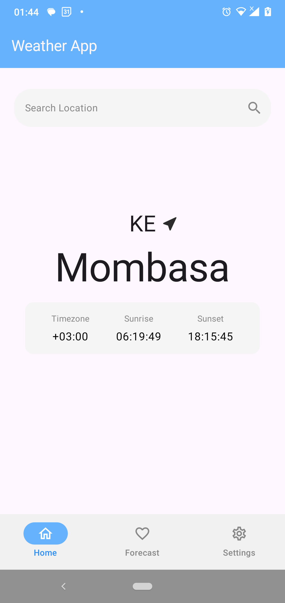
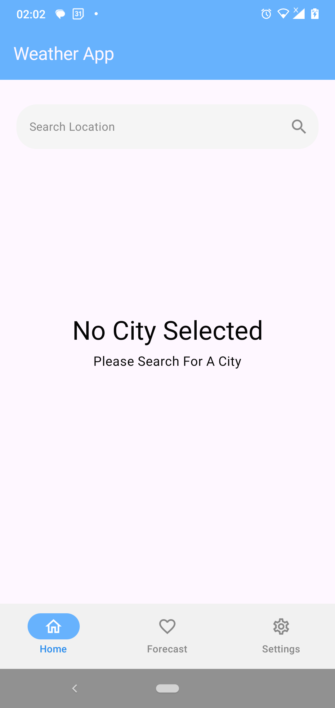
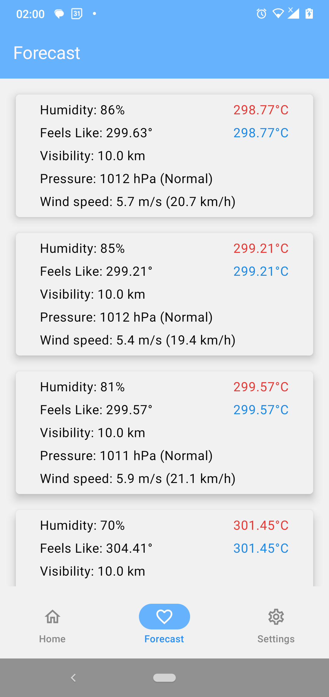
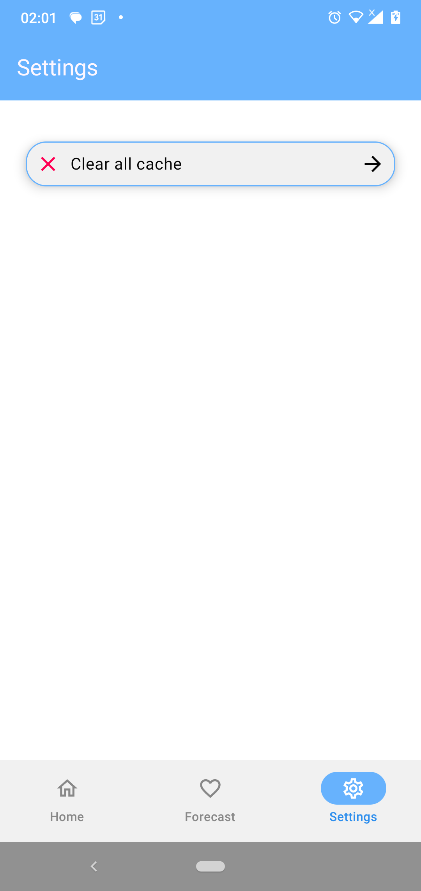
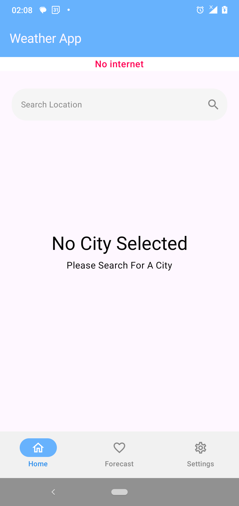
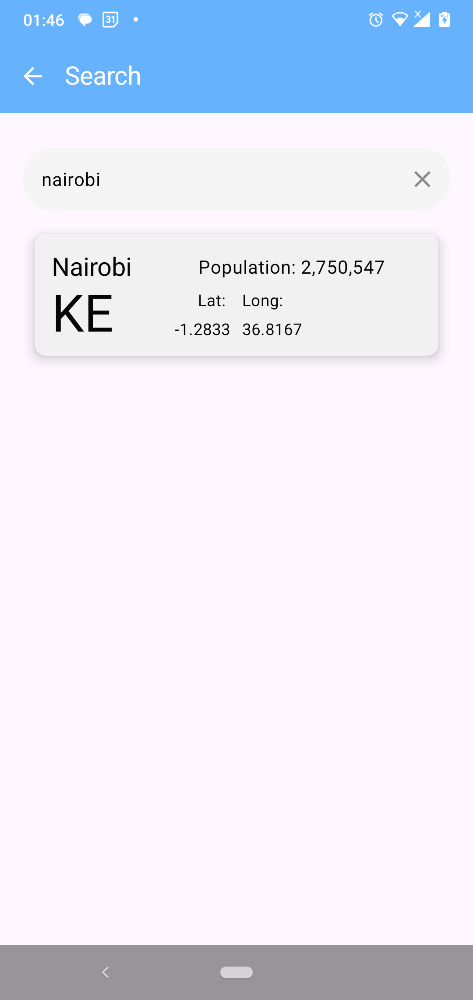
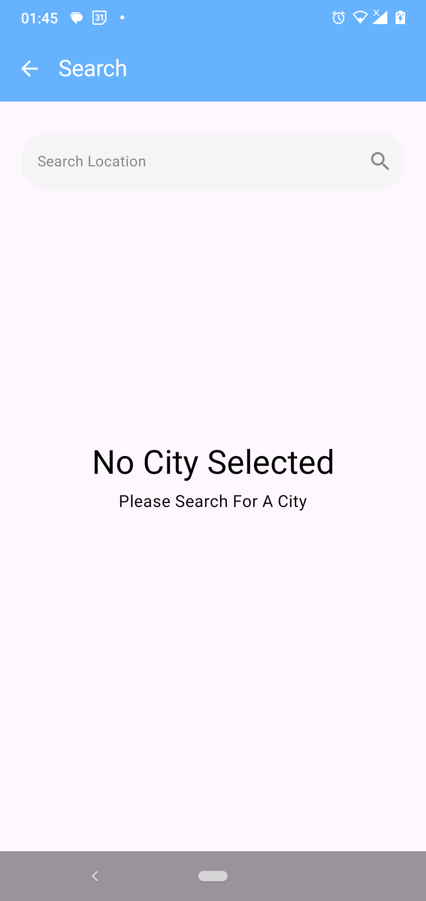
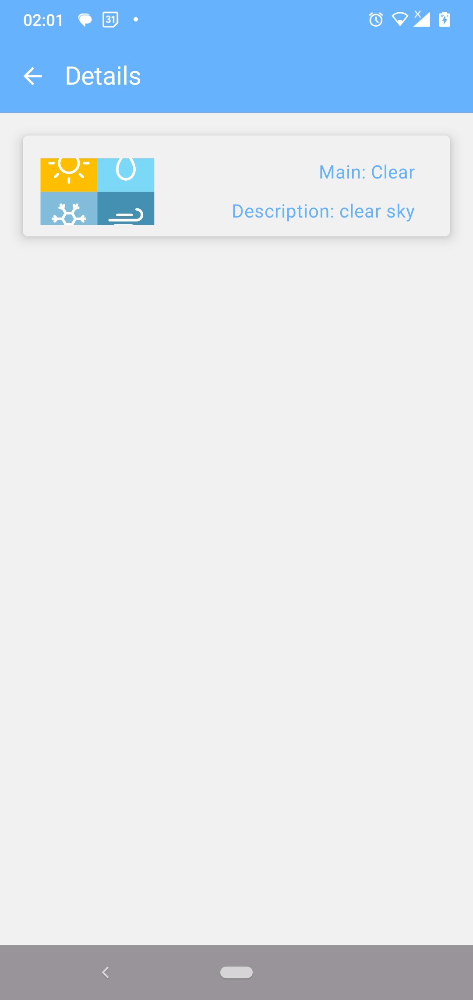

# _Project Setup Guide_

## Installation Steps
- Clone the composeApp branch
- Open in Android Studio

## Launch Android Studio
- Select "Open an existing project"
- Navigate to the cloned repository
- Select the project directory

## Install Debug App

- Connect an Android device or set up an emulator
- Click "Run" (green play button) in Android Studio
- Select your target device
- Wait for the app to build and install

## Troubleshooting

- Ensure you have the latest Android SDK tools
- Verify your device/emulator meets minimum API requirements
- Check internet connection for gradle dependencies

## Recommended Environment

- Android Studio Meerkat or Narwhal
- Gradle 8.0+
- Kotlin 2.0

## Architecture and Components
- Modular app structure (core, presentation and app modules)
    - core module – Contains shared resources like data sources, utilities, and common extensions used across the app.
    - app module – The main entry point (Application class), responsible for bootstrapping the app and combining all modules together.
    - presentation module - Contains the UI components.
- MVVM,
    - Model – Represents data and business rules (from repositories or use cases).
    - ViewModel – Handles business logic, state management, and exposes observable data to the UI.
    - View (Compose UI) – Observes StateFlow from the ViewModel and renders UI accordingly.
- Jetpack compose to build all screens and UI components, ensuring a responsive user experience with clean architecture and one-way data flow,
- Koin for DI,
- DataStore for caching data,
- Retrofit HTTP client,
- Moshi, JSON library for serializing and deserializing JSON
- State management with stateflow. The app uses StateFlow to:
    - Emit and observe UI state changes from ViewModels to the UI.
    - Handle data loading states (Loading, Success, Error) using a sealed ResultState class

## Screenshots

### Home Screen

### Forecast Screen

### Settings Screen

### No Internet scenario

### Search Screen

### Details Screen

